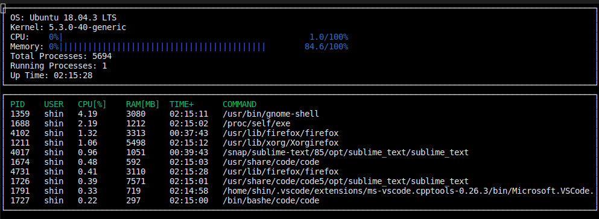
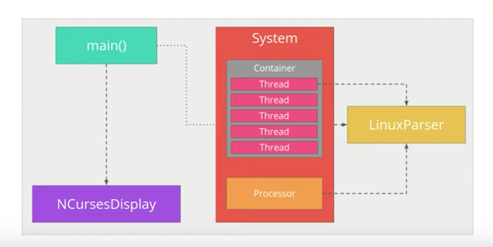

# CppND-System-Monitor

A linux process mananger for linux system similar to "htop". The starter code is from [here](https://github.com/udacity/CppND-System-Monitor-Project-Updated.git). Most of the work is on parsing the linux file system in the proc directory.
Below is the screen shot of the output on my computer.

File structure (screenshot from the Udacity's lecture note)

## Dependencies: ncurses
[ncurses](https://www.gnu.org/software/ncurses/) is a library that facilitates text-based graphical output in the terminal. This project relies on ncurses for display output.

To install ncurses: `sudo apt install libncurses5-dev libncursesw5-dev`

## To Run the Project
* `build make`
* `./build/monitor`

## Make
This project uses [Make](https://www.gnu.org/software/make/). The Makefile has four targets:
* `build` compiles the source code and generates an executable
* `format` applies [ClangFormat](https://clang.llvm.org/docs/ClangFormat.html) to style the source code
* `debug` compiles the source code and generates an executable, including debugging symbols
* `clean` deletes the `build/` directory, including all of the build artifacts

## Addional info that I read to complete the project:
1. /proc/stat (http://www.linuxhowtos.org/System/procstat.htm)
2. jiffies to seconds conversion (https://stackoverflow.com/questions/2731463/converting-jiffies-to-milli-seconds)
3. passwd file format (https://www.cyberciti.biz/faq/understanding-etcpasswd-file-format/)
4. `sysconf(_SC_CLK_TCK)` (https://stackoverflow.com/questions/19919881/sysconf-sc-clk-tck-what-does-it-return) & `sysconf` (http://man7.org/linux/man-pages/man3/sysconf.3.html)

